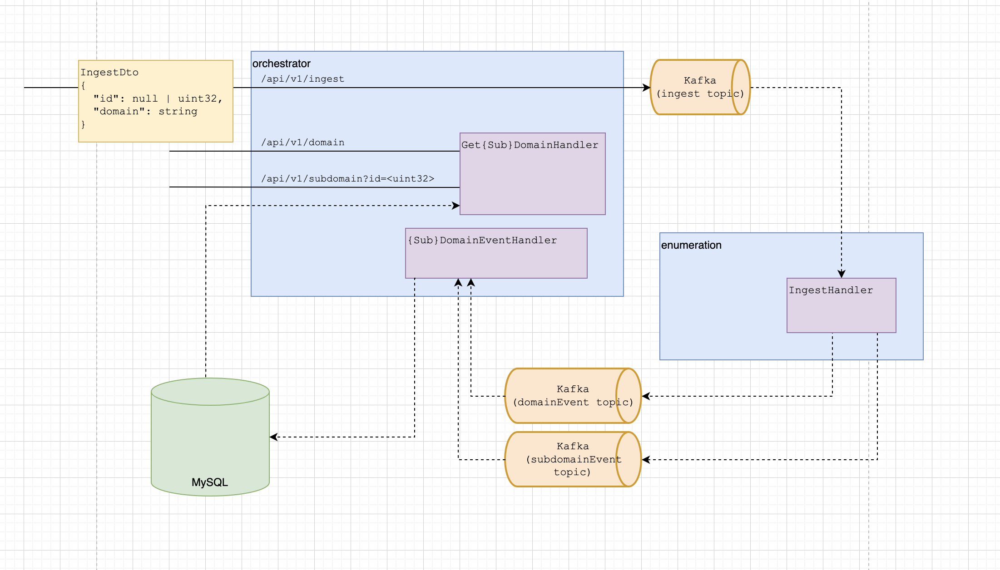

# product-golang-backend-interview

This interview station involves a small microservice architecture that scans root domains for subdomains and persists that information in a SQL database.



## Component Breakdown

There are four components in this project:
 - Orchestrator (`orchestrator/`)
   - API server that serves for requests to scan a domain and view information about previously scanned domains and their subdomains
 - Enumeration (`enumeration/`)
   - Ingests a domain, iterates over its subdomains, and publishes individual events for the subdomains
 - MySQL (`docker-compose.yaml`)
   - Consists of a `scanner` database accessible to the root user
 - Kafka (`docker-compose.yaml`)
    - Consists of a zookeeper and a single broker

### Usage:
To run the Kafka and MySQL containers, spin them up with docker-compose:

```$ docker-compose up -d```

Don't forget to create the kafka topics:
```
./create-topics.sh
```